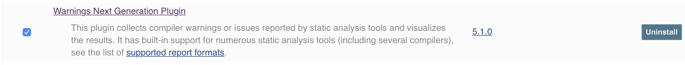

# PMD Example with Maven Multi-Module Project

## Adding PMD to Jenkins Steps

### 1. Ensure the *Warnings Next Generation Plugin* Jenkins Plugin is installed.

### 2. Add an *Execute Shell* build step invoking  *./mvnw pmd:pmd* 

### 3. Add a *Record compiler warnings and static analysis results* post-build action. 

### 4. Run a build, and enjoy the PMD Status Reports

### 5. Optional - add a quality gate for notifications on new violations

### 6. Optional - add Slack notifications on broken builds. 

Steps at: 

[https://github.com/jenkinsci/slack-plugin](https://github.com/jenkinsci/slack-plugin)

